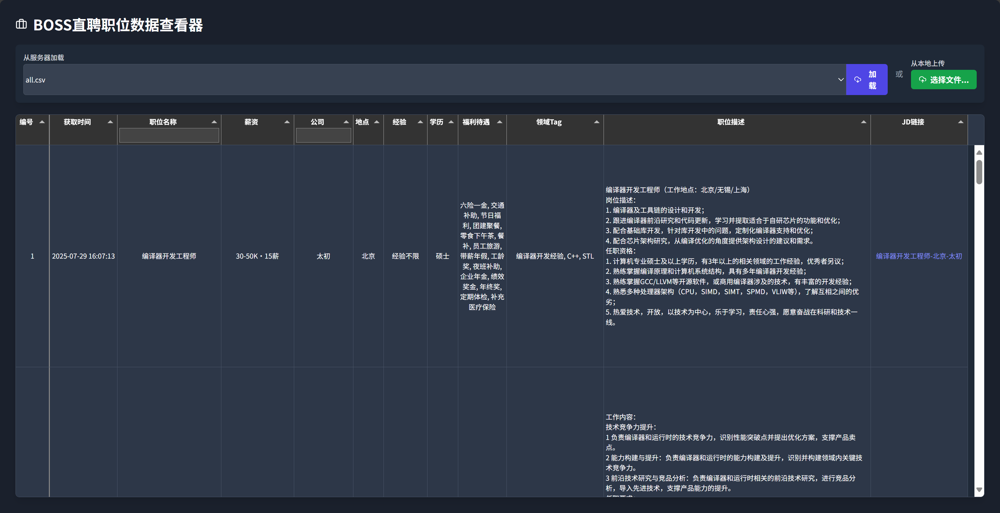

# Boss-Hunter

> Boss 直聘 JD 爬虫 | 可视化



- **收藏职位**：基于 [Playwright](https://playwright.dev/) 自动化抓取 BOSS 直聘PC端 *“我感兴趣的”* 列表中的所有职位信息
- **Dashboard**：数据面板——展示和分析爬取到的数据


## 环境准备

项目依赖以下环境：

- **Python 3.10+**: Python 3.10 或更高版本。
- **安装 Python 库**:
    ```bash
    pip install -r requirements.txt
    ```

- **安装 Playwright 所需浏览器**: (首次运行时需要执行)
    ```bash
    patchright install chrome
    ```

---

## 使用说明

### 目录结构

```
/项目文件夹
|-- main.py                 # 爬虫主程序
|-- login_manager.py        # 登录模块
|-- job_scraper.py          # 爬虫与数据提取模块
|-- data_manager.py         # 数据保存与合并模块
|-- app.py                  # Flask网页应用主程序
|
|-- boss_data/              # (需手动创建) 用于存放爬虫生成的所有数据文件
|   |-- all.csv             # (自动生成) 所有职位的总表
|
|-- cookies.json            # (自动生成) 登录状态保存文件
|
|-- README.md
```

### 第一步：运行爬虫

1.  运行主程序：
    ```bash
    python main.py
    ```
2.  **首次运行**：程序会自动打开一个Chrome浏览器窗口并跳转到BOSS直聘的登录页。按照提示，**手动切换到二维码扫码登录**。成功登录一次后，登录状态会被保存在 `cookies.json` 文件中，后续再运行大概率无需再次扫码。
3.  程序会自动开始爬取数据，终端将输出实时的进度日志。
4.  爬取结束后，所有生成的文件（本次运行的CSV/JSON，以及更新后的 `all.csv` 总表）都会保存在 `boss_data` 文件夹中。

### 第二步：查看数据

1.  确保爬虫已至少成功运行一次，并且 `boss_data` 文件夹中已有数据文件。
2.  在同一个终端中，运行网页应用：
    ```bash
    python app.py
    ```
3.  终端会提示应用已在 `http://127.0.0.1:5000` (或 `http://0.0.0.0:5000`) 上运行。
4.  浏览器访问 `http://127.0.0.1:5000`。
5.  顶部的 **「下拉菜单」** 选择 `boss_data` 目录中的文件加载，也可以通过 **「上传按钮」** 从本地电脑的任意位置选择文件进行查看。
